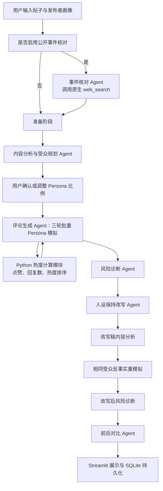

 # CommentLab：面向个人创作者的多 Agent 社交媒体内容发布风险模拟系统

## AI 实践课程大作业报告

| 项目 | 内容 |
| --- | --- |
| 项目名称 | CommentLab |
| 中文名称 | 面向个人创作者的多 Agent 社交媒体内容发布风险模拟系统 |
| 项目类型 | AI 实践基石课程大作业 |
| 小组成员 | 陈思琪（2025013242）、张若西（2025013223） |

---

## 摘要

个人创作者在发布社交媒体短帖、个人观点或公开回应前，通常只能从“自己想表达什么”的角度检查文本，难以同时考虑不同受众的阅读深度、初始信任、情绪敏感度以及评论区热门观点对后续讨论的影响。一段原意明确的内容，可能因为模糊指代、限定条件缺失、语气过强或上下文不足，被解读为攻击群体、回避责任或传播未经确认的信息。

CommentLab 是一个面向个人创作者的发布前沟通风险模拟系统。系统首先分析帖子语义并规划受众构成，随后以不同 Persona 模拟三轮评论、回复和点赞行为，识别误解、负面情绪、争吵对立和话题跑偏风险，将风险回指到具体原文片段，并生成保持发布者人设的改写稿。系统再使用相同 Persona、随机种子、轮数和热度规则重新模拟改写稿，以反事实方式比较修改前后的风险变化。

本项目采用角色化多 Agent 固定工作流，而不是让多个 Agent 自由对话。内容分析、评论生成、风险诊断、改写和比较等角色由结构化提示词和 Pydantic 数据契约约束；联网事件核对通过模型原生 `web_search` 工具完成；潜水用户点赞、评论热度和风险分数使用确定性 Python 代码计算；SQLite 用于项目历史、完整结果快照和模型响应缓存。

截至报告撰写时，远程项目共有 54 项自动化测试全部通过。包含 30 个案例的真实模型评测取得 109/150 分，其中 7 个现实案例中的评论争议预测命中 6 个。评测同时显示，系统在争议主题识别和改写忠实度方面表现较好，但风险等级校准、改写稳定降险和评论证据回指仍是后续优化重点。

---

## 一、项目背景

### 1.1 问题来源

内容发布前的沟通风险往往不是由单个敏感词决定，而是由文本、受众和互动环境共同形成。例如：

> 最近会适当降低更新频率，希望大家理解。

发布者可能只想说明短期减少更新，但不同受众会产生不同反应：

- 核心粉丝可能认为创作者需要休息；
- 普通关注者可能追问具体频率和持续时间；
- 标题式阅读者可能直接概括为“准备停更”；
- 怀疑型受众可能猜测账号数据或团队出现问题；
- 热门评论获得更多点赞后，后续用户可能沿着这一解释继续讨论。

传统文案工具通常关注语法、敏感词或总体情绪，难以完整呈现“某句话如何被不同受众理解，以及某种理解如何被评论区互动继续放大”。因此，本项目将大语言模型的角色模拟能力与确定性计算结合，构建发布前的沟通压力测试。

### 1.2 目标用户

项目主要面向：

- 普通社交媒体用户；
- 个人内容创作者；
- 知识、生活、娱乐或观点类博主；
- 需要发布个人公开回应的用户。

目前不面向政府、学校行政部门或大型企业公关团队，不提供组织级危机公关决策。

### 1.3 项目目标

系统希望帮助用户回答以下问题：

1. 原帖中哪些表达存在较大的解释空间？
2. 哪类受众容易产生不同理解？
3. 哪些理解可能被点赞和回复继续放大？
4. 风险能否回指到具体原文片段？
5. 如何在不改变核心观点和个人语气的情况下修改？
6. 修改后，在相同受众条件下风险是否真正降低？

### 1.4 使用边界

CommentLab 是沟通风险压力测试工具，而不是真实舆情预测系统。系统遵循以下边界：

- 不承诺模拟评论等同于真实网友评论；
- 不把风险等级解释为真实事件发生概率；
- 不判断用户观点在价值或政治意义上是否正确；
- 不读取用户账号历史、私信、图片和视频；
- 联网核对只用于公开事件背景，不搜索普通个人敏感信息；
- 不把来源不足或存在争议的信息写成已确认事实；
- 目前保持平台无关，不模仿具体平台或真实用户。

---

## 二、需求分析

### 2.1 核心输入

系统接收两类输入：

1. 不超过 500 个字符的中文短帖；
2. 简版发布者画像，包括身份、内容领域、粉丝规模、表达风格和受众关系。

对于可能指向公开事件的帖子，用户还可以提供可选事件线索并启用联网背景核对。

### 2.2 核心输出

系统输出包括：

- 内容语义和初步沟通风险分析；
- 可调整的受众 Persona 构成；
- 三轮树状模拟评论区；
- 误解、负面情绪、冲突和跑题指标；
- 可回指原文的风险片段与误解链；
- 保持发布者风格的改写稿；
- 原文与改写稿的反事实重模拟结果；
- 修改前后的风险对比和历史项目记录。

### 2.3 非功能需求

- **稳定性：** 单个模型阶段失败时，完整流程仍可降级运行；
- **可复现性：** 固定随机种子和热度规则；
- **结构稳定：** 模型输出使用 Pydantic 校验；
- **可解释性：** 风险必须有原文片段、评论或互动指标作为依据；
- **成本控制：** Persona 评论按轮次批量生成；
- **可演示性：** 无密钥时仍可使用 `DEMO_MODE` 跑通完整业务流程。

---

## 三、系统总体架构

CommentLab 采用“固定编排器 + 专业角色 Agent + 确定性 Python 模块 + SQLite”的混合架构。



### 3.1 代码结构

```text
Big_task_v1/
├── app.py                         # Streamlit 页面和交互流程
├── config.py                      # 环境变量与运行配置
├── chains/
│   ├── preparation_chain.py       # 内容分析与初始受众规划
│   ├── content_analysis_chain.py  # 内容语义与文本风险分析
│   ├── audience_chain.py          # Persona 规划
│   ├── comment_chain.py           # 多轮批量评论生成
│   ├── risk_chain.py              # 风险诊断与确定性评分
│   ├── rewrite_chain.py           # 人设保持改写与改写审计
│   └── comparison_chain.py        # 改写前后对比
├── services/
│   ├── orchestrator.py            # 固定业务流程编排
│   ├── llm_client.py              # 模型调用、结构化输出与缓存
│   ├── web_research.py            # Responses API 联网搜索
│   └── database.py                # SQLite 持久化
├── simulation/
│   ├── engine.py                  # 三轮模拟和 Persona 激活
│   └── heat.py                    # 点赞、回复数和热度计算
├── models/
│   └── schemas.py                 # Pydantic 数据契约
├── evaluation/
│   └── runner.py                  # 30 个案例的自动化评测
├── data/
│   ├── personas.json              # Persona 模板
│   ├── demo_cases.json            # 演示案例
│   └── eval_cases.json            # 30 个评测案例
└── tests/                         # 单元测试与流程测试
```

---

## 四、多 Agent 设计

### 4.1 Agent 的定义

本项目中的 Agent 是具有明确任务、专用提示词、结构化输入输出和上下游依赖的角色节点。它们由 `CommentLabOrchestrator` 按固定顺序调度，而不是自由决定整个业务流程。

这种设计牺牲了一部分自治性，但具有以下优势：

- 流程容易复现；
- 每个阶段的责任清晰；
- 便于测试和定位错误；
- 避免 Agent 无限讨论或重复调用；
- 更适合课程的成本与时间限制。

### 4.2 Agent 分工

| Agent/角色 | 主要职责 | 关键输出 |
| --- | --- | --- |
| 事件核对 Agent | 搜索并核对帖子可能指向的公开事件 | 事件名、关键事实、不确定性、来源 |
| 准备阶段 Agent | 一次生成相互一致的内容分析与初始受众方案 | `ContentAnalysis`、`AudiencePlan` |
| 内容分析 Agent | 提取核心表达、语气、限定条件、模糊片段和潜在误解 | 结构化文本分析 |
| 受众规划 Agent | 从本地 Persona 模板中分配权重和群体比例 | 受众构成 |
| 评论生成 Agent | 按 Persona 属性批量生成评论、回复、点赞或忽略动作 | `CommentBatch` |
| 风险诊断 Agent | 根据文本分析和评论模拟提取风险片段、误解链和修改方向 | `RiskReport` |
| 改写 Agent | 保留观点和人设，逐项修复已定位风险 | `RewriteResult` |
| 比较 Agent | 比较原帖与改写稿在相同模拟条件下的差异 | `ComparisonReport` |

### 4.3 Persona 是否是独立 Agent

系统中每个 Persona 都有阅读深度、信任度、情绪敏感度和争议倾向等属性，但为了控制 Token 和延迟，同一轮中的多个 Persona 由一次模型请求批量处理。项目没有为每个 Persona 单独启动一个模型进程。

> 系统采用角色化多 Agent 工作流，并在评论生成阶段使用批量 Persona 模拟。

### 4.4 共享状态

Agent 之间通过结构化状态传递信息：

- 内容分析结果为受众规划、评论生成和风险诊断提供语义依据；
- 联网核对结果被压缩为统一背景事实卡；
- 所有 Persona 接收相同背景，避免信息不对称干扰反事实对比；
- 每轮评论 Agent 读取部分热门评论，形成短期互动上下文；
- 改写前后保持 Persona、比例、随机种子、轮数和热度规则一致。

---

## 五、提示词工程

### 5.1 结构化输入输出

所有主要 Agent 使用 Pydantic Schema 约束输出。例如，评论动作必须包含：

- Persona ID；
- 动作类型；
- 评论文本；
- 回复目标；
- 立场和情绪；
- 情绪强度与争议度；
- 误解和跑题程度；
- 证据片段；
- 反应类型。

结构化输出使模型结果可以直接进入模拟、评分、数据库和页面展示，减少自由文本解析错误。

### 5.2 提示词中的任务边界

提示词重点约束以下行为：

- 不判断观点对错；
- 不发明 Persona 或真实用户名；
- 不把不确定背景写成事实；
- 风险片段必须逐字来自原帖；
- 回复只能指向已提供的评论 ID；
- 不允许所有 Persona 输出同一种“建议补充信息”；
- 改写不能撤回核心观点或添加未知事实；
- 不能只在原文后追加免责声明来伪装降险。

### 5.3 提示词与确定性代码分工

项目没有把所有决策交给模型：

- LLM 负责语义理解、角色表达、风险解释和文案改写；
- Python 负责比例归一化、随机选择、热度计算、评分和阈值判断；
- Pydantic 负责数据契约；
- SQLite 负责缓存和历史。

这种分工减少了模型进行状态管理时的错误。

### 5.4 降级策略

当缺少模型配置或模型阶段连续失败时，系统使用本地启发式方法生成同一数据结构的降级结果。`DEMO_MODE` 并不是静态展示页面，三轮状态推进、热度计算、风险评分和 SQLite 持久化仍会执行。

---

## 六、Tool 与确定性计算模块

### 6.1 Tool

`services/web_research.py` 使用 OpenAI-compatible Responses API 的原生 `web_search` 工具。模型根据帖子和事件线索执行联网搜索，并返回本次搜索实际发现的来源。

搜索结果经过以下处理：

1. 提取搜索返回的 URL 和标题；
2. URL 去重并提取域名；
3. 将事实声明绑定到具体来源索引；
4. 没有来源支持的 `confirmed` 或 `party_statement` 自动降级为 `uncertain`；
5. 非法 JSON 不注入后续 Agent；
6. 搜索失败时继续运行原有文本分析和模拟流程。

### 6.2 Python 热度模拟的准确定位

`simulation/heat.py` 中的点赞和热度逻辑是普通 Python 函数，由 `SimulationEngine` 按固定工作流调用。

其功能包括：

- 模拟约 50 个潜水用户的点赞；
- 根据 Persona 倾向决定更可能点赞的评论；
- 更新评论回复数；
- 计算热度分数；
- 为下一轮选择可见热门评论。

> 联网核对 Agent 使用原生 `web_search` 工具；评论热度由固定工作流中的确定性 Python 计算模块完成，以保证可复现性。

### 6.3 后续可增加的工具

为了进一步体现 Tool 的价值，可增加确定性证据校验工具：

```text
validate_evidence_span(
    post_text,
    parent_comment,
    evidence_span
) -> validation_result
```

顶级评论的证据必须来自原帖，回复的证据必须来自原帖或父评论。模型负责提出证据，工具负责确定性校验，两者职责清晰。

---

## 七、Memory 与持久化

### 7.1 当前已实现的记忆形式

项目存在以下状态保存机制：

1. **轮次工作记忆：** 后续评论轮读取前序热门评论；
2. **流程共享状态：** Agent 接收统一的文本分析、背景事实卡和 Persona 配置；
3. **项目历史：** SQLite 保存输入、Persona、评论、风险报告和完整结果快照；
4. **模型缓存：** 相同模型请求可以直接复用结构化结果。

### 7.2 与长期 Agent Memory 的区别

SQLite 历史记录和 LLM 缓存属于持久化机制，但当前系统没有从多个历史项目中主动检索用户偏好，也没有形成可更新的发布者长期记忆。

### 7.3 可选的长期记忆方案

若课程要求进一步展示 Memory，可增加用户主动授权的“发布者偏好记忆”：

- 保存用户接受或拒绝过的改写方式；
- 记录希望保留的口头表达和不希望出现的官方化措辞；
- 只向改写 Agent 检索少量相似历史；
- 不让历史记忆参与风险评分，避免形成自我强化；
- 在页面明确展示本次使用了哪些记忆；
- 支持关闭、清空和删除。

当前数据规模较小，可继续使用 SQLite，无需为了形式引入向量数据库。

---

## 八、联网搜索与证据机制

### 8.1 搜索目的

搜索不负责判断发布者观点是否正确，而是解决“帖子可能指向什么公开事件、哪些信息已确认、哪些信息仍有争议”的问题。

搜索背景被压缩为统一事实卡，包括：

- 事件名称；
- 一句简短结论；
- 最多三条事实声明；
- 每条声明的状态；
- 一条主要不确定性。

### 8.2 事实状态

系统使用四种事实状态：

| 状态 | 含义 |
| --- | --- |
| `confirmed` | 有可靠公开来源支持 |
| `party_statement` | 当事方或相关方的公开说法 |
| `disputed` | 存在公开争议，不能直接确认 |
| `uncertain` | 当前来源不足或无法确定 |

### 8.3 背景共享

成功的联网结果会传给内容分析、受众规划、评论、风险、改写和对比角色。原帖与改写稿使用完全相同的背景，从而保证风险变化主要来自文本变化。

如果搜索失败、未启用或没有可靠结论，系统不会伪造背景，而是返回 `None` 并继续运行。

### 8.4 当前评测限制

主评测为了可复现和控制联网成本，现实案例主要使用预先保存的固定背景，因而评测的是“背景注入后的系统表现”，并没有充分覆盖搜索工具本身的事件匹配和来源质量。

后续应建立独立搜索评测集，测量：

- 事件匹配准确率；
- 声明有来源支撑的比例；
- 不确定信息误写为事实的比例；
- 来源质量和时效性；
- 搜索失败时的安全降级。

---

## 九、多轮评论与热度模拟

### 9.1 Persona 模板

系统使用本地受控 Persona 模板，包括核心粉丝、普通关注者、路人、标题阅读者、理性追问者、专业纠错者、动机怀疑者、商业怀疑者、情绪共鸣者、玩梗用户和争议放大者等角色。

每个 Persona 包含：

- 阅读深度；
- 对发布者的初始信任；
- 情绪敏感度；
- 争议倾向；
- 所属群体和权重；
- 是否主动发言。

模型只能调整模板权重，不能发明真实用户。

### 9.2 三轮模拟

默认模拟三轮，激活人数分别为 7、4、3：

1. 第一轮形成首批独立评论；
2. 第二轮根据热门评论生成新顶级评论或回复；
3. 第三轮观察误解、情绪和冲突是否继续传播。

后续轮不允许所有回复集中在同一热门评论下，系统会将回复分配到不同分支，并保留新的顶级评论。

### 9.3 潜水用户

约 50 个潜水用户不调用模型发言，只通过 Python 规则点赞。其作用是模拟“沉默多数”对评论可见性的影响，同时控制模型调用成本。

### 9.4 模拟指标

系统统计：

- 误解评论比例；
- 负面评论比例；
- 冲突回复数量；
- 跑题评论比例；
- 评论情绪强度；
- 评论争议程度；
- 热度和可见评论排序。

---

## 十、风险诊断与改写

### 10.1 风险维度

系统评估四类沟通风险：

| 风险类型 | 权重 |
| --- | ---: |
| 误解风险 | 40% |
| 负面情绪风险 | 30% |
| 冲突风险 | 20% |
| 跑题风险 | 10% |

最终风险分由文本分析和评论模拟共同决定：

```text
最终风险分 = 文本分析分 × 25% + 模拟结果分 × 75%
```

模型负责提取证据、误解链和修改方向，具体分数由 Python 根据可见指标确定，避免模型自行进行不稳定算术。

### 10.2 误解链

误解链必须从原帖的连续片段开始，描述：

```text
原文片段
→ 受众如何补全未说明信息
→ 形成何种误解
→ 热门评论如何继续放大
```

如果模型提供的来源片段无法在原帖中找到，系统会尝试匹配其他合法风险片段；无法锚定的误解链将被丢弃。

### 10.3 人设保持改写

改写遵循以下原则：

- 不撤回核心观点；
- 不添加原帖和背景中不存在的新事实；
- 不把个人表达统一改成机构声明；
- 优先修复已经定位的风险片段；
- 保留发布者主要表达风格；
- 不允许“风险句完全不改，只在后面添加免责声明”。

系统会对改写稿再次分析和模拟。只有风险分低于原帖时才采用候选稿，否则保留原文并提示用户继续人工修改。

### 10.4 反事实公平性

原帖与改写稿固定以下条件：

- Persona 模板；
- Persona 权重和群体比例；
- 随机种子；
- 模拟轮数；
- 每轮激活数量；
- 潜水用户数量；
- 热度规则；
- 联网背景。

这样可以尽量把风险差异归因于帖子文本变化。

---

## 十一、数据存储与系统可靠性

### 11.1 SQLite 数据

数据库保存：

- `projects`：项目输入、改写稿和完整 JSON 快照；
- `personas`：实际使用的 Persona 配置；
- `comments`：原帖和改写稿的模拟评论；
- `reports`：前后风险报告及对比报告；
- `llm_cache`：结构化模型响应缓存。

历史项目从完整快照直接恢复，不重新调用模型。

### 11.2 模型调用可靠性

- 模型响应使用 Pydantic 校验；
- 非法 JSON 可清理代码围栏和尾随逗号；
- 每个模型阶段最多尝试两次；
- 连续失败后使用本地降级结果；
- 一个 Agent 失败不会导致整个项目状态丢失；
- 缺少模型配置时自动进入 `DEMO_MODE`。

### 11.3 安全管理

- `.env` 不提交版本库；
- `*.db`、日志、PID 和端口文件均已加入 `.gitignore`；
- 页面和报告不输出真实 API 密钥；
- 联网核对禁止搜索普通个人敏感信息；
- 不读取用户真实账号历史。

---

## 十二、测试与评测

### 12.1 自动化测试

远程项目当前测试结果为：

```text
54 passed in 0.51s
```

测试覆盖：

- 数据模型与字段约束；
- 500 字输入限制；
- Persona 比例归一化；
- 随机种子和多轮激活；
- 评论、回复和热度；
- 风险权重和等级阈值；
- 改写审计和免责声明式假修复；
- SQLite 保存、缓存和历史恢复；
- 联网搜索结果解析与来源绑定；
- 共享背景注入；
- 输出证据保护；
- 评测程序本身。

### 12.2 评测集

评测集包含 30 个案例，包括真实网络事件案例和合成的沟通风险案例。真实案例保留人工整理的主要争议主题和真实评论，用于在系统生成结束后进行隐藏对照，避免真实评论泄漏到生成过程。

### 12.3 最新真实模型评测

| 指标 | 结果 |
| --- | ---: |
| 核心得分 | 109/150 |
| 现实案例评论争议预测 | 6/7 |
| 风险等级命中 | 13/30 |
| 风险片段命中 | 23/30 |
| 主要争议主题命中 | 29/30 |
| 改写忠实度命中 | 28/30 |
| 文本降险命中 | 16/30 |
| 重复评论数量 | 0 |
| 无效评论证据片段 | 105 条 |

### 12.4 结果分析

系统表现较好的部分：

- 能够识别大多数案例的主要争议主题；
- 现实案例的模拟评论与真实评论争议方向较接近；
- 改写通常可以保留核心观点；
- 评论重复控制效果较好；
- 结构化输出和完整流程较稳定。

主要问题：

1. 风险等级只命中 13/30，固定分箱和等级阈值和人工标注有一定出入，需要数据校准；
2. 文本降险只命中 16/30，部分改写可能改变措辞但没有降低真正的风险；
3. 105 条评论的 `evidence_span` 无法回指原帖或父评论；
4. 当前最新报告是快速反馈评测，改写稿没有全部重新执行完整评论模拟；
5. 主评测使用固定背景，没有充分测试实时搜索工具。

### 12.5 评测可信度说明

评测结果用于发现系统弱点，而不能证明系统可以准确预测真实舆情。由于案例数量有限、风险标签具有主观性，后续还需要人工盲评和保留测试集。

---

## 十三、项目创新点

### 13.1 发布前压力测试

系统不是等待真实争议发生后监控舆情，而是在帖子发布前模拟不同理解路径。

### 13.2 风险回指原文

风险报告不仅给出抽象分数，还尝试定位具体原文片段，并建立从原文到误解和传播的链路。

### 13.3 同受众反事实重模拟

系统使用相同 Persona 和随机条件重新测试改写稿，避免只让改写 Agent 自己评价自己的文案。

### 13.4 LLM 与确定性代码结合

LLM 负责开放语义任务，Python 负责热度、随机状态、比例和评分。这比全部依赖模型更可复现。

### 13.5 有证据状态的联网背景

联网结果区分已确认事实、当事方声明、争议信息和不确定信息，并要求关键声明绑定本次搜索来源。

---

## 十四、现存问题与优化计划

### 14.1 缓存与提示词版本

当前模型缓存键未包含系统提示词内容。修改提示词后可能继续读取旧缓存。后续应加入：

- Prompt 版本或内容哈希；
- Schema 名称和版本；
- 评测版本；
- 各阶段独立温度。

### 14.2 风险评分校准

将评测案例划分为开发集和保留测试集，对评分分箱、风险权重和高低风险阈值进行网格搜索或交叉验证，同时保留确定性评分的可解释性。

### 14.3 证据校验工具

在评论写入模拟结果前验证 `evidence_span`：

- 顶级评论必须回指原帖；
- 回复可以回指原帖或父评论；
- 无效证据局部修复或清空；
- 页面支持点击证据定位原文。

### 14.6 第六优先级：可选长期 Memory

在用户授权下记录发布者接受或拒绝的改写方式，只供后续改写参考，不参与风险算分，并提供关闭和删除功能。

## 十五、伦理、隐私与风险

### 15.1 模拟偏见

Persona 模板和模型训练数据可能放大刻板印象。系统应避免按性别、地域或其他敏感属性生成攻击性角色，并允许用户查看和调整受众构成。

### 15.2 过度相信模拟

模拟结果可能使用户误以为系统能够准确预测真实网友。页面必须持续展示免责声明，并把结果描述为压力测试和风险提示。

### 15.3 搜索错误

搜索来源可能过时、互相矛盾或受到网页内容干扰。系统需要保留来源链接、事实状态和不确定性，不能仅凭模型文字断言事实。

### 15.4 隐私

系统不应自动建立真实账号画像，不保存不必要的敏感信息。若以后增加长期 Memory，必须采用显式授权、最小存储和可删除设计。

### 15.5 改写的价值边界

降低沟通冲突不等于压制合理观点。改写应帮助用户表达得更清楚，而不是强迫用户变得中性、官方或回避立场。

---

## 十六、团队分工

项目由陈思琪、张若西共同完成，具体分工如下：

| 成员 | 分工内容 |
| --- | --- |
| 张若西 | **Agent 与模型链：** LangChain 和 Pydantic 结构化输出；内容分析、受众规划、评论生成、风险诊断、改写和对比 Agent。 |
| 陈思琪 | **系统、规则、测试与界面：** 进一步优化模型；Streamlit 页面与交互；潜水用户、点赞、热度、排序和树状回复展示；自动测试；设计 30 个案例组成的评测集、进行轻量化案例测试。 |
| 共同完成 | Persona 模板；风险标准；实验分析、演示脚本、报告和展示材料。 |

---

## 十七、总结

CommentLab 完成了从帖子输入、受众构造、多轮评论模拟、风险诊断、人设保持改写到反事实验证的完整业务闭环。项目已经实际运用多 Agent 分工、结构化提示词、模型原生联网工具、确定性 Python 计算、短期共享状态、SQLite 持久化和自动化评测等课程知识。

项目的主要价值不在于生成看似真实的评论，而在于通过多种受众视角暴露文本中的解释空间，并将风险定位到具体表达。项目同时保持了对技术边界的克制：没有将固定 Python 函数包装成虚假的自主 Tool Calling，没有将数据库缓存直接宣传为长期 Agent Memory，也没有把模拟结果描述为真实舆情概率。

现阶段系统在争议主题识别、现实评论方向覆盖和改写忠实度方面已经取得较好结果，但风险等级校准、改写稳定降险、证据片段有效性和搜索专项评测仍需进一步完善。后续工作将优先围绕这些有评测依据的问题展开，而不是继续增加复杂但缺少实际价值的 Agent 数量。

---

## 附录 A：运行与验证

### A.1 安装依赖

```bash
python -m pip install -r requirements.txt
```

### A.2 启动应用

```bash
python -m streamlit run app.py --server.port 8502
```

### A.3 健康检查

```bash
curl -fsS http://127.0.0.1:8502/_stcore/health
```

预期返回：

```text
ok
```

### A.4 自动化测试

```bash
python -m pytest -q
```

当前结果：

```text
54 passed in 0.51s
```

### A.5 评测集测试

该测试时间较长，其中前7个为真实案例，后23个为机器生成文案、人工标注风险等级。

```bash
python -m evaluation.runner --feedback-only
```

---

## 参考资料

1. Park, J. S. et al. *Social Simulacra: Creating Populated Prototypes for Social Computing Systems*. 2022.
2. Gao, C. et al. *S3: Social-network Simulation System with Large Language Model-Empowered Agents*. 2023.
3. Yang, Z. et al. *OASIS: Open Agents Social Interaction Simulations with One Million Agents*. 2024.
4. LangChain Documentation. *Structured Output*.
5. OpenAI-compatible Responses API 文档与项目所使用模型服务文档。
