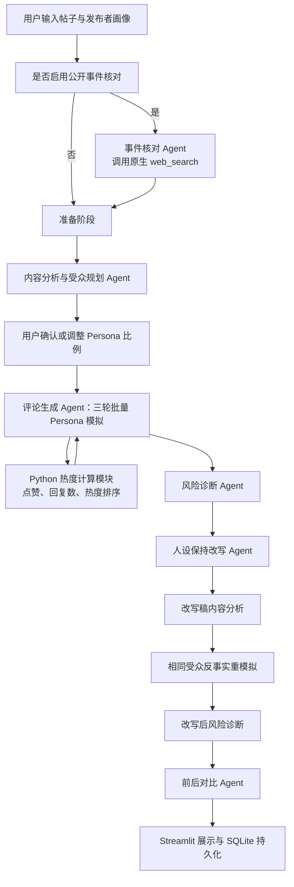

 # CommentLab：面向个人创作者的多 Agent 社交媒体内容发布风险模拟系统

## AI 实践课程大作业报告

| 项目 | 内容 |
| --- | --- |
| 项目名称 | CommentLab |
| 中文名称 | 面向个人创作者的多 Agent 社交媒体内容发布风险模拟系统 |
| 项目类型 | AI 实践基石课程大作业 |
| 小组成员 | 陈思琪（2025013242）、张若西（2025013223） |

---

## 摘要

个人创作者在发布社交媒体短帖、个人观点或公开回应前，通常只能从“自己想表达什么”的角度检查文本，难以同时考虑不同受众的阅读深度、初始信任、情绪敏感度以及评论区热门观点对后续讨论的影响。一段原意明确的内容，可能因为模糊指代、限定条件缺失、语气过强或上下文不足，被解读为攻击群体、回避责任或传播未经确认的信息。

CommentLab 是一个面向个人创作者的发布前沟通风险模拟系统。系统首先分析帖子语义并规划受众构成，随后以不同 Persona 模拟三轮评论、回复和点赞行为，识别误解、负面情绪、争吵对立和话题跑偏风险，将风险回指到具体原文片段，并生成保持发布者人设的改写稿。系统再使用相同 Persona、随机种子、轮数和热度规则重新模拟改写稿，以反事实方式比较修改前后的风险变化。

本项目采用角色化多 Agent 固定工作流，而不是让多个 Agent 自由对话。内容分析、评论生成、风险诊断、改写和比较等角色由结构化提示词和 Pydantic 数据契约约束；联网事件核对通过模型原生 `web_search` 工具完成；潜水用户点赞、评论热度和风险分数使用确定性 Python 代码计算；SQLite 用于项目历史、完整结果快照和模型响应缓存。

截至报告撰写时，远程项目共有 54 项自动化测试全部通过。包含 30 个案例的真实模型评测取得 109/150 分，其中 7 个现实案例中的评论争议预测命中 6 个。评测同时显示，系统在争议主题识别和改写忠实度方面表现较好，但风险等级校准、改写稳定降险和评论证据回指仍是后续优化重点。

---

## 一、项目背景

### 1.1 问题来源

内容发布前的沟通风险往往不是由单个敏感词决定，而是由文本、受众和互动环境共同形成。例如：

> 最近会适当降低更新频率，希望大家理解。

发布者可能只想说明短期减少更新，但不同受众会产生不同反应：

- 核心粉丝可能认为创作者需要休息；
- 普通关注者可能追问具体频率和持续时间；
- 标题式阅读者可能直接概括为“准备停更”；
- 怀疑型受众可能猜测账号数据或团队出现问题；
- 热门评论获得更多点赞后，后续用户可能沿着这一解释继续讨论。

传统文案工具通常关注语法、敏感词或总体情绪，难以完整呈现“某句话如何被不同受众理解，以及某种理解如何被评论区互动继续放大”。因此，本项目将大语言模型的角色模拟能力与确定性计算结合，构建发布前的沟通压力测试。

### 1.2 相关研究与研究空白

#### 1.2.1 现有多 Agent 社交模拟研究

已有研究证明了大语言模型社会模拟的可行性：Social Simulacra 面向社区设计生成帖子、回复和反社会行为；S³ 研究情绪、态度和观点传播；OASIS 支持发帖、评论、关注、推荐及动态社交网络。它们主要服务于平台机制、群体极化、信息传播和宏观社会实验，本项目则将尺度收缩到个人创作者的一条待发布内容。

#### 1.2.2 本项目拟解决的空白

本项目聚焦的问题是：普通创作者如何在内容发布前发现易被误读的表述，并验证修改后的文本是否更稳健？

本项目的差异化重点包括：

1. 发布前而非发布后；
2. 面向普通个人和创作者；
3. 重点追踪误解链；
4. 风险归因到具体文本；
5. 加入发布者身份、人设和跨项目记忆；
6. 保持人设进行改写；
7. 使用同一批受众进行反事实重模拟。

### 1.3 目标用户

项目主要面向：

- 普通社交媒体用户；
- 个人内容创作者；
- 知识、生活、娱乐或观点类博主；
- 需要发布个人公开回应的用户。

目前不面向政府、学校行政部门或大型企业公关团队，不提供组织级危机公关决策。

### 1.4 项目目标

系统希望帮助用户回答以下问题：

1. 原帖中哪些表达存在较大的解释空间？
2. 哪类受众容易产生不同理解？
3. 哪些理解可能被点赞和回复继续放大？
4. 风险能否回指到具体原文片段？
5. 如何在不改变核心观点和个人语气的情况下修改？
6. 修改后，在相同受众条件下风险是否真正降低？

### 1.5 使用边界

CommentLab 是沟通风险压力测试工具，而不是真实舆情预测系统。系统遵循以下边界：

- 不承诺模拟评论等同于真实网友评论；
- 不把风险等级解释为真实事件发生概率；
- 不判断用户观点在价值或政治意义上是否正确；
- 不读取用户账号历史、私信、图片和视频；
- 联网核对只用于公开事件背景，不搜索普通个人敏感信息；
- 不把来源不足或存在争议的信息写成已确认事实；
- 目前保持平台无关，不模仿具体平台或真实用户。

---

## 二、需求分析

| 类别 | 需求 |
| --- | --- |
| 输入 | 500 字以内中文短帖；身份、领域、粉丝规模、表达风格和受众关系；可选事件线索与联网核对。 |
| 输出 | 内容分析、可调 Persona、三轮树状评论、四类风险指标、证据片段与误解链、人设保持改写、反事实对比和历史记录。 |
| 稳定性 | 单个模型阶段失败时可降级运行，无密钥时用 `DEMO_MODE` 跑通流程。 |
| 可复现与结构稳定 | 固定随机种子和热度规则，模型输出使用 Pydantic 校验。 |
| 可解释与成本 | 风险由文本或互动证据支持；同轮 Persona 批量生成以控制调用成本。 |

---

## 三、系统总体架构

CommentLab 采用“固定编排器 + 专业角色 Agent + 确定性 Python 模块 + SQLite”的混合架构。



### 3.1 代码结构

```text
Big_task_v1/
├── app.py                         # Streamlit 页面和交互流程
├── config.py                      # 环境变量与运行配置
├── chains/                        # 准备、分析、受众、评论、风险、改写、比较模型链
├── services/
│   ├── orchestrator.py            # 固定业务流程编排
│   ├── llm_client.py              # 模型调用、结构化输出与缓存
│   ├── web_research.py            # Responses API 联网搜索
│   └── database.py                # SQLite 持久化
├── simulation/                    # 三轮模拟、Persona 激活和热度计算
├── models/schemas.py              # Pydantic 数据契约
├── evaluation/runner.py           # 30 个案例的自动化评测
├── data/                          # Persona、演示和评测案例
└── tests/                         # 单元测试与流程测试
```

---

## 四、多 Agent 设计

### 4.1 Agent 的作用

本项目中的 Agent 是具有明确任务、专用提示词、结构化输入输出和上下游依赖的角色节点。它们由 `CommentLabOrchestrator` 按固定顺序调度，而不是自由决定整个业务流程。

这种设计牺牲部分自治性，换取流程可复现、责任清晰、易测试和成本可控。

### 4.2 Agent 分工

| Agent/角色 | 主要职责 | 关键输出 |
| --- | --- | --- |
| 事件核对 Agent | 搜索并核对帖子可能指向的公开事件 | 事件名、关键事实、不确定性、来源 |
| 准备阶段 Agent | 一次生成相互一致的内容分析与初始受众方案 | `ContentAnalysis`、`AudiencePlan` |
| 内容分析 Agent | 提取核心表达、语气、限定条件、模糊片段和潜在误解 | 结构化文本分析 |
| 受众规划 Agent | 从本地 Persona 模板中分配权重和群体比例 | 受众构成 |
| 评论生成 Agent | 按 Persona 属性批量生成评论、回复、点赞或忽略动作 | `CommentBatch` |
| 风险诊断 Agent | 根据文本分析和评论模拟提取风险片段、误解链和修改方向 | `RiskReport` |
| 改写 Agent | 保留观点和人设，逐项修复已定位风险 | `RewriteResult` |
| 比较 Agent | 比较原帖与改写稿在相同模拟条件下的差异 | `ComparisonReport` |

### 4.3 Persona 是否是独立 Agent

系统中每个 Persona 都有阅读深度、信任度、情绪敏感度和争议倾向等属性，但为了控制 Token 和延迟，同一轮中的多个 Persona 由一次模型请求批量处理。项目没有为每个 Persona 单独启动一个模型进程。

> 系统采用角色化多 Agent 工作流，并在评论生成阶段使用批量 Persona 模拟。

### 4.4 共享状态

Agent 之间通过结构化状态传递信息：

- 内容分析结果为受众规划、评论生成和风险诊断提供语义依据；
- 联网核对结果被压缩为统一背景事实卡；
- 所有 Persona 接收相同背景，避免信息不对称干扰反事实对比；
- 每轮评论 Agent 读取部分热门评论，形成短期互动上下文；
- 改写前后保持 Persona、比例、随机种子、轮数和热度规则一致。

---

## 五、提示词工程

### 5.1 结构化输入输出

所有主要 Agent 使用 Pydantic Schema 约束输出。评论动作包含 Persona ID、动作类型、文本、回复目标、立场、情绪、争议度、误解和跑题程度、证据片段及反应类型，使结果可直接进入模拟、评分、数据库和页面展示。

### 5.2 提示词中的任务边界

提示词要求模型不判断观点对错、不发明 Persona 或真实用户名、不把不确定背景写成事实；风险片段必须逐字来自原帖，回复只能指向已提供的评论 ID。评论需体现 Persona 差异；改写不能撤回核心观点、添加未知事实，或只追加免责声明来伪装降险。

### 5.3 提示词与确定性代码分工

LLM 负责语义理解、角色表达、风险解释和改写；Python 负责比例归一化、随机选择、热度、评分和阈值；Pydantic 负责数据契约；SQLite 负责缓存和历史。该分工减少了模型承担算术和状态管理时的错误。

### 5.4 降级策略

当缺少模型配置或模型阶段连续失败时，系统使用本地启发式方法生成同一数据结构的降级结果。`DEMO_MODE` 并不是静态展示页面，三轮状态推进、热度计算、风险评分和 SQLite 持久化仍会执行。

---

## 六、Tool 与确定性计算模块

### 6.1 Tool

`services/web_research.py` 使用 OpenAI-compatible Responses API 的原生 `web_search` 工具。模型根据帖子和事件线索执行联网搜索，并返回本次搜索实际发现的来源。

搜索结果经过以下处理：

1. 提取搜索返回的 URL 和标题；
2. URL 去重并提取域名；
3. 将事实声明绑定到具体来源索引；
4. 没有来源支持的 `confirmed` 或 `party_statement` 自动降级为 `uncertain`；
5. 非法 JSON 不注入后续 Agent；
6. 搜索失败时继续运行原有文本分析和模拟流程。

### 6.2 Python 热度模拟的准确定位

`simulation/heat.py` 中的点赞和热度逻辑是普通 Python 函数，由 `SimulationEngine` 按固定工作流调用。

其功能包括：

- 模拟约 50 个潜水用户的点赞；
- 根据 Persona 倾向决定更可能点赞的评论；
- 更新评论回复数；
- 计算热度分数；
- 为下一轮选择可见热门评论。

> 联网核对 Agent 使用原生 `web_search` 工具；评论热度由固定工作流中的确定性 Python 计算模块完成，以保证可复现性。

### 6.3 后续可增加的工具

后续可增加确定性 `validate_evidence_span` 工具：顶级评论证据必须来自原帖，回复证据必须来自原帖或父评论。模型提出证据，工具负责字符串校验和定位。

---

## 七、Memory 与持久化

### 7.1 当前已实现的多层记忆

项目存在以下状态保存机制：

1. **轮次工作记忆：** 后续评论轮读取前序热门评论；
2. **流程共享状态：** Agent 接收统一的文本分析、背景事实卡和 Persona 配置；
3. **项目历史：** SQLite 保存输入、Persona、评论、风险报告和完整结果快照；
4. **发布者用户记忆：** SQLite 按不同发布者保存最近画像、累计发布次数、最近内容和可读摘要；
5. **模型缓存：** 相同模型请求可以直接复用结构化结果。

### 7.2 发布者用户长期记忆

`services/database.py` 的 `publishers` 表按发布者保存名称、最近画像、累计发布次数、最近正文和可读摘要。输入页“用户记忆”卡片支持选择或新增用户，并可将上次保存的身份、领域、粉丝规模、表达风格和受众关系回填到输入区。

每次提交分析时，系统都会根据当前画像和发布内容更新对应用户的记忆。不同发布者使用独立记录，互不覆盖。最近发布内容保存完整正文；读取旧记录时，系统会优先从历史项目结果中补全同一发布者的完整内容，避免只保留过短摘录。

准备态和结果态通过可选 `publisher_id` 关联发布者，因此旧历史结果仍可兼容加载。这属于结构化、任务相关的长期记忆，不是对真实账号的自动画像。

### 7.3 可优化方向

当前尚未学习用户接受或拒绝的改写方式、希望保留的口头表达及不同内容类型下的风格变化。现阶段 SQLite 结构化检索足够；后续偏好学习必须用户可见、可控制，且不能直接干预风险评分。

---

## 八、联网搜索与证据机制

### 8.1 搜索目的

搜索不负责判断发布者观点是否正确，而是解决“帖子可能指向什么公开事件、哪些信息已确认、哪些信息仍有争议”的问题。

搜索背景被压缩为统一事实卡，包括事件名、简短结论、最多三条带状态的事实声明和一条主要不确定性。

### 8.2 事实状态

系统使用四种事实状态：

| 状态 | 含义 |
| --- | --- |
| `confirmed` | 有可靠公开来源支持 |
| `party_statement` | 当事方或相关方的公开说法 |
| `disputed` | 存在公开争议，不能直接确认 |
| `uncertain` | 当前来源不足或无法确定 |

### 8.3 背景共享

成功的联网结果会传给内容分析、受众规划、评论、风险、改写和对比角色。原帖与改写稿使用完全相同的背景，从而保证风险变化主要来自文本变化。

如果搜索失败、未启用或没有可靠结论，系统不会伪造背景，而是返回 `None` 并继续运行。

### 8.4 当前评测限制

主评测为保证可复现并控制联网成本，现实案例主要使用固定背景，因此尚未充分覆盖搜索工具本身。后续专项评测应测量事件匹配、来源支撑率、不确定信息误写率、来源质量与时效性，以及失败时的安全降级。

---

## 九、多轮评论与热度模拟

### 9.1 Persona 模板

系统使用本地受控 Persona 模板，包括核心粉丝、普通关注者、路人、标题阅读者、理性追问者、专业纠错者、动机怀疑者、商业怀疑者、情绪共鸣者、玩梗用户和争议放大者等角色。

每个 Persona 包含阅读深度、初始信任、情绪敏感度、争议倾向、群体权重和发言倾向。模型只能调整模板权重，不能发明真实用户。

### 9.2 三轮模拟

默认模拟三轮，激活人数分别为 7、4、3：

1. 第一轮形成首批独立评论；
2. 第二轮根据热门评论生成新顶级评论或回复；
3. 第三轮观察误解、情绪和冲突是否继续传播。

后续轮不允许所有回复集中在同一热门评论下，系统会将回复分配到不同分支，并保留新的顶级评论。

### 9.3 潜水用户

约 50 个潜水用户不调用模型发言，只通过 Python 规则点赞。其作用是模拟“沉默多数”对评论可见性的影响，同时控制模型调用成本。

### 9.4 模拟指标

系统统计误解评论比例、负面评论比例、冲突回复数、跑题比例、情绪强度、争议程度、热度和可见评论排序。

---

## 十、风险诊断与改写

### 10.1 风险维度

系统评估四类沟通风险：

| 风险类型 | 权重 |
| --- | ---: |
| 误解风险 | 40% |
| 负面情绪风险 | 30% |
| 冲突风险 | 20% |
| 跑题风险 | 10% |

最终风险分由文本分析和评论模拟共同决定：

```text
最终风险分 = 文本分析分 × 25% + 模拟结果分 × 75%
```

模型负责提取证据、误解链和修改方向，具体分数由 Python 根据可见指标确定，避免模型自行进行不稳定算术。

### 10.2 误解链

误解链必须从原帖的连续片段开始，描述：

```text
原文片段
→ 受众如何补全未说明信息
→ 形成何种误解
→ 热门评论如何继续放大
```

如果模型提供的来源片段无法在原帖中找到，系统会尝试匹配其他合法风险片段；无法锚定的误解链将被丢弃。

### 10.3 人设保持改写

改写遵循以下原则：

- 不撤回核心观点；
- 不添加原帖和背景中不存在的新事实；
- 不把个人表达统一改成机构声明；
- 优先修复已经定位的风险片段；
- 保留发布者主要表达风格；
- 不允许“风险句完全不改，只在后面添加免责声明”。

系统会对改写稿再次分析和模拟。只有风险分低于原帖时才采用候选稿，否则保留原文并提示用户继续人工修改。

### 10.4 反事实公平性

原帖与改写稿固定以下条件：

- Persona 模板；
- Persona 权重和群体比例；
- 随机种子；
- 模拟轮数；
- 每轮激活数量；
- 潜水用户数量；
- 热度规则；
- 联网背景。

这样可以尽量把风险差异归因于帖子文本变化。

### 10.5 端到端历史案例：《空洞骑士》游戏设计评价

为展示系统如何从文本证据形成可解释结论，下面选取网页历史结果中的《空洞骑士》案例。原帖集中批评二代的成长曲线、BOSS 反馈、念珠经济和陷阱设计，其中“你二代是怎么能做得这么差的”“评价为拉完了”等表达被识别为直接指责和绝对化定性。

系统在联网核对后，把讨论对象识别为《空洞骑士：丝之歌》的设计争议，并将同一份精简背景提供给全部评论 Agent。模拟评论出现了三条有代表性的解释路径：

- 只看结论的用户把批评概括为“二代彻底翻车”，放大了原帖结论；
- 商业化敏感用户把资源紧张推断成“逼氪”，产生原帖没有提出的动机归因；
- 专业纠错用户指出游戏没有氪金系统，形成事实纠错和对立回复。


系统没有撤回发布者对游戏设计的不满，而是把笼统判断改为更具体的个人体验，例如将“打完 BOSS 基本一点反馈都没有”细化为“打完一些 BOSS 后的反馈不够强，比如奖励很少或缺乏成就感”，并把对开发者的直接质问改为对设计原因的追问。


| 对比指标 | 原文 | 改写后 | 变化 |
| --- | ---: | ---: | ---: |
| 综合风险 | 高 | 中 | 下降一级 |
| 误解比例 | 14.3% | 7.1% | -7.2 个百分点 |
| 负面情绪比例 | 71.4% | 21.4% | -50.0 个百分点 |
| 对立回复数 | 3 | 2 | 减少 1 条 |
| 跑题比例 | 0% | 0% | 不变 |


该案例说明，具体化和主观化表达能够减少误解与情绪扩散，但不能保证所有局部指标同时改善。改写稿仍保留“很多小怪都不掉钱”“有些地方感觉是为难而难”等较强定性，因此部分护主和反驳心理仍被触发。系统给出的“高风险降为中风险”应被理解为同条件压力测试结果，而不是对真实舆情的概率预测。

---

## 十一、数据存储与系统可靠性

### 11.1 SQLite 数据

数据库保存：

- `projects`：项目输入、改写稿和完整 JSON 快照；
- `personas`：实际使用的 Persona 配置；
- `comments`：原帖和改写稿的模拟评论；
- `reports`：前后风险报告及对比报告；
- `llm_cache`：结构化模型响应缓存。

历史项目从完整快照直接恢复，不重新调用模型。

### 11.2 模型调用可靠性

- 模型响应使用 Pydantic 校验；
- 非法 JSON 可清理代码围栏和尾随逗号；
- 每个模型阶段最多尝试两次；
- 连续失败后使用本地降级结果；
- 一个 Agent 失败不会导致整个项目状态丢失；
- 缺少模型配置时自动进入 `DEMO_MODE`。

### 11.3 安全管理

- `.env` 不提交版本库；
- `*.db`、日志、PID 和端口文件均已加入 `.gitignore`；
- 页面和报告不输出真实 API 密钥；
- 联网核对禁止搜索普通个人敏感信息；
- 不读取用户真实账号历史。

---

## 十二、评测

### 12.1 自动化测试

远程项目当前测试结果为：

```text
54 passed
```

测试覆盖数据模型与字段约束、输入限制、Persona 比例归一化、随机种子、多轮评论与热度、风险评分、改写审计、SQLite 缓存与历史恢复、发布者记忆、联网来源绑定、共享背景、证据保护及评测程序本身。测试耗时受设备和缓存状态影响，因此报告只保留通过数量，不把单次运行时间作为性能结论。

### 12.2 评测集

评测集包含 30 个案例，包括真实网络事件案例和合成的沟通风险案例。真实案例保留人工整理的主要争议主题和真实评论，用于在系统生成结束后进行隐藏对照，避免真实评论泄漏到生成过程。

### 12.3 最新真实模型评测

| 指标 | 结果 |
| --- | ---: |
| 核心得分 | 109/150 |
| 现实案例评论争议预测 | 6/7 |
| 风险等级命中 | 13/30 |
| 风险片段命中 | 23/30 |
| 主要争议主题命中 | 29/30 |
| 改写忠实度命中 | 28/30 |
| 文本降险命中 | 16/30 |
| 重复评论数量 | 0 |
| 无效评论证据片段 | 105/421（24.9%） |

### 12.4 测试结论：项目优势

综合自动化测试和 30 案例评测，项目目前具有以下优势：

1. **争议发现能力较强。** 主要争议主题命中 29/30，说明系统能够发现帖子发布后可能围绕哪些问题展开讨论。
2. **现实评论方向具有一定参考价值。** 7 个现实案例中有 6 个覆盖了真实评论的主要争议方向。
3. **改写忠实度较高。** 28/30 的案例能够保留原帖核心观点和关键条件，没有简单地把所有内容改成中性或官方表达。
4. **结构化流程稳定。** LangChain、Pydantic、SQLite、三轮模拟和反事实对比能够形成完整闭环，54 项自动化测试全部通过。
5. **评论重复控制较好。** 30 个案例中没有检测到完全重复评论，多 Persona 的表达具有一定差异。
6. **失败具有可控降级。** 模型调用、联网搜索或结构化解析失败时，不会直接中断整个流程。

由此可见，CommentLab 当前最可靠的能力是：

> 发现帖子可能引发的主要争议和解释路径，并在保留发布者观点的前提下提供可验证的修改方案。

### 12.5 测试结论：局限性

1. **风险等级命中较低。** 风险等级仅命中 13/30，系统容易把高风险和低风险案例集中判断为中风险。
2. **文本降险不够稳定。** 文本降险命中 16/30，部分改写虽然更加委婉或完整，但没有修复核心推断、群体概括或事实断言。
3. **评论证据回指不足。** 421 条评论中有 105 条（24.9%）的 `evidence_span` 无法回指原帖或父评论，说明部分评论听起来合理，却缺少可验证的文本依据。
4. **轻量评测不是完整端到端评测。** 为了控制评测的时长，当前报告采用 `feedback_only`，改写稿没有全部重新执行三轮评论、热度和对比模拟。
5. **搜索工具评测不足。** 主评测使用固定背景卡，保证了可复现性，但由于控制评测的总时长，没有充分检验实时搜索的事件匹配、来源质量和时效性。
6. **同一套系统参与生成和评价。** 评论生成、风险判断、改写和比较使用相近的模型与规则，可能形成内部自洽偏差。

### 12.6 风险等级差异的原因分析

风险等级仅命中 13/30，首先说明评分阈值存在实质校准问题：系统容易把高、低风险样本集中判断为中风险。另一方面，人工标签也不是完全客观的金标准：人工更依赖生活经验，且可能把群体贬损、价值伤害和事实错误直接视为高风险；当前系统主要度量误解、负面情绪、冲突和跑题，并受到阈值、样本量、联网背景、模型随机性和 Prompt 版本影响。

因此需要同时校准模型和提高人工标签可靠性。后续除命中率外，还应记录多人标注一致度、分歧案例、连续风险分距离，以及高风险漏判和低风险误报的内容类型，不能以任一方的局限为另一方免责。

### 12.7 基于测试结果的优化方向

优化重点归纳为四类：风险校准与多人标注、证据强校验、完整端到端重复评测、搜索专项评测与独立盲评。第十四节进一步给出优先级和验收方式。

### 12.8 评测可信度说明

评测结果用于发现系统弱点，而不能证明系统可以准确预测真实舆情。

---

## 十三、项目创新点

| 创新点 | 具体体现 |
| --- | --- |
| 发布前压力测试 | 在内容发布前模拟不同受众的理解和传播路径，而不是等待争议发生后再监控。 |
| 风险回指原文 | 从具体文本片段出发建立“原文—推断—误解—传播”链，而非只给抽象分数。 |
| 同受众反事实重模拟 | 固定 Persona、背景、随机种子和热度规则比较改写前后，减少比较条件变化。 |
| LLM 与确定性代码结合 | LLM 处理开放语义任务，Python 负责热度、比例、随机状态和评分，兼顾表达能力与可复现性。 |
| 有证据状态的联网背景 | 区分事实、声明、争议信息和不确定信息，关键结论绑定本次搜索来源。 |

---

## 十四、现存问题与优化计划

| 优先级 | 问题与行动 | 验收方式 |
| --- | --- | --- |
| P0 | 校准风险分箱、权重和高中低阈值；开发集调参。 | 提高等级命中率，并单独报告高风险漏判。 |
| P0 | 在结果写入前校验 `evidence_span`；顶级评论回指原帖，回复回指原帖或父评论。 | 无效证据比例由 24.9% 显著下降，页面可点击定位证据。 |
| P1 | 对保留案例执行完整的改写后三轮模拟，并记录多次运行方差。 | 报告均值、波动范围和各指标方向，而非只比较文本分析分。 |
| P1 | 建立搜索专项评测和独立人工盲评。 | 分别报告事件识别、来源绑定、自然度和改写忠实度。 |
| P2 | 在用户授权下记录接受或拒绝的改写偏好，并提供记忆关闭、清空和删除入口。 | 偏好只影响改写建议，不直接参与风险算分。 |

## 十五、伦理、隐私与风险

| 风险 | 控制原则 |
| --- | --- |
| Persona 与训练数据放大刻板印象 | 避免按敏感属性生成攻击性角色，允许用户查看和调整受众构成。 |
| 用户过度相信模拟 | 持续标注“压力测试而非真实舆情预测”，展示局部指标和不确定性。 |
| 搜索来源过时或相互矛盾 | 保留来源链接、事实状态和不确定性，不仅凭模型文字断言事实。 |
| 发布者记忆带来隐私风险 | 只保存用户主动填写的画像和项目正文，发布者之间严格隔离，并补充关闭、清空和删除入口。 |
| 降低冲突变成压制观点 | 保留核心立场和个人风格，使表达更清楚，而不是强迫内容变得中性或官方。 |

---

## 十六、团队分工

| 成员 | 分工内容 |
| --- | --- |
| 张若西 | **Agent 与模型链：** LangChain 和 Pydantic 结构化输出；内容分析、受众规划、评论生成、风险诊断、改写和对比 Agent。 |
| 陈思琪 | **系统、规则、测试与界面：** 进一步优化模型；Streamlit 页面与交互；潜水用户、点赞、热度、排序和树状回复展示；自动测试；设计 30 个案例组成的评测集、进行轻量化案例测试。 |
| 共同完成 | Persona 模板；风险标准；实验分析、演示脚本、报告和展示材料。 |

---

## 十七、总结

CommentLab 完成了从帖子输入、发布者记忆、受众构造、多轮评论模拟、风险诊断、人设保持改写到反事实验证的完整业务闭环。项目已经实际运用多 Agent 分工、结构化提示词、模型原生联网工具、确定性 Python 计算、短期共享状态、SQLite 发布者长期记忆、项目持久化和自动化评测等课程知识。

项目的主要价值不在于生成看似真实的评论，而在于通过多种受众视角暴露文本中的解释空间，并将风险定位到具体表达。项目同时区分了模型缓存、项目历史和发布者用户记忆，没有将固定 Python 函数包装成虚假的自主 Tool Calling，也没有把模拟结果描述为真实舆情概率。

现阶段系统在争议主题识别、现实评论方向覆盖和改写忠实度方面已经取得较好结果，但风险等级校准、改写稳定降险、证据片段有效性和搜索专项评测仍需进一步完善。风险等级与人工标注的差异既反映了机器评分不足，也反映了沟通风险本身的主观性和机器、人类判断标准的不完全一致。后续工作将优先围绕多人标注、阈值校准、证据校验和完整端到端评测展开，而不是继续增加复杂但缺少实际价值的 Agent 数量。

---

## 附录 A：运行与验证

### A.1 安装依赖

```bash
python -m pip install -r requirements.txt
```

### A.2 启动应用

```bash
python -m streamlit run app.py --server.port 8502
```

### A.3 健康检查

```bash
curl -fsS http://127.0.0.1:8502/_stcore/health
```

预期返回：

```text
ok
```

### A.4 自动化测试

```bash
python -m pytest -q
```

当前结果：

```text
54 passed
```

### A.5 评测集测试

该测试时间较长，其中前7个为真实案例，后23个为机器生成文案，人工标注风险等级。

```bash
python -m evaluation.runner --feedback-only
```

---

## 参考资料

1. Social Simulacra  
   https://arxiv.org/abs/2208.04024

2. S³: Social-network Simulation System with Large Language Model-Empowered Agents  
   https://arxiv.org/abs/2307.14984

3. OASIS: Open Agent Social Interaction Simulations with One Million Agents  
   https://arxiv.org/abs/2411.11581

4. OASIS GitHub  
   https://github.com/camel-ai/oasis